# Deployment

- The app was deployed to [Render](https://render.com/).
- The database was deployed to [ElephantSQL](https://www.elephantsql.com/).

- The app can be reached by the [link](https://driveready.onrender.com/).

---

---

## Render Deployment (Backend)

### Create Database on ElephantSQL

1. Go to [ElephantSQL](https://www.elephantsql.com/) and create a new account.

2. Create a new instance of the database.

   - 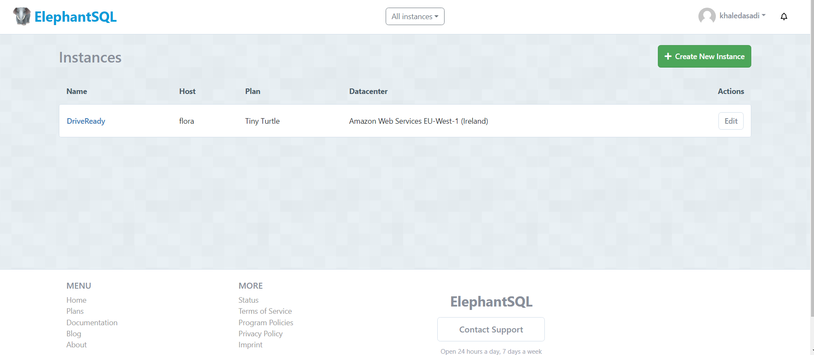

3. Select a name for your database and select the free plan.

   - 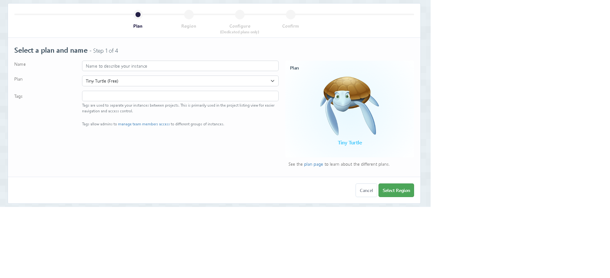

4. Select a region close to you.

   - 

5. Click "Review"

   - 

6. Click "Create Instance"

   - 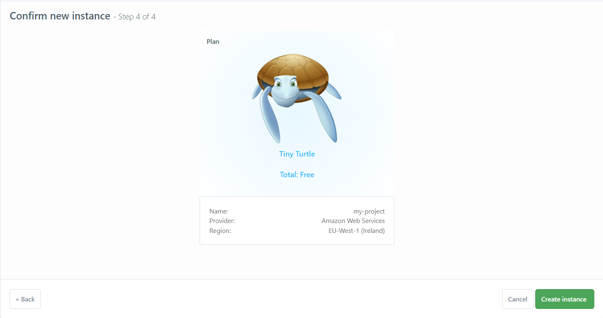

7. Click on the name of your database to open the dashboard.

   - 

8. You will see the dashboard of your database. You will need the URL of your database to connect it to your Django project.

   - 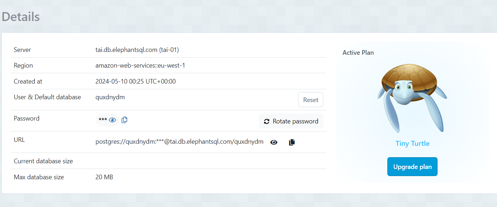

### Create a new app on Render

1.  Create a new Render account if you don't already have one here [Render](https://render.com/).

2.  Create a new application on the following page here [New Render App](https://dashboard.render.com/), choose **Webserver**:

    - 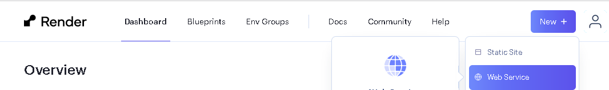

3.  Search for the repository you created and click "Connect."

4.  Create name for the application

    - 

5.  Select the region where you want to deploy the application.

    - 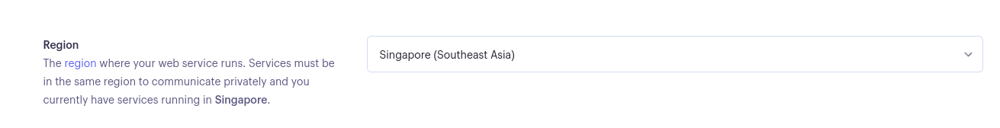

6.  Select branch to deploy.

    - 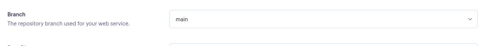

7.  Select environment.

    - 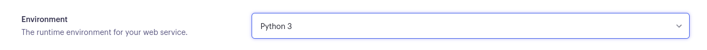

8.  Render build command: `./build.sh`

    - 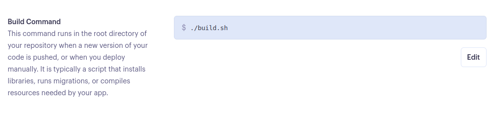

9.  Select Free plan.

    - 

10. Click on "Advanced" settings.

11. Add the following environment variables:

    | Key                   | Value              |
    | --------------------- | ------------------ |
    | WEB_CONCURRENCY       | 4                  |
    | DATABASE_URL          | **\*\***\***\*\*** |
    | SECRET_KEY            | **\*\***\***\*\*** |
    | DEBUG                 | False              |
    | DISABLE_COLLECTSTATIC | 1                  |

    DATABASE_URL value is takes from ElephantSQL dashboard, SECRET_KEY value is takes from your local env.py file.

12. Open VS Code and create a new file called `build.sh` in the root directory of your project.

13. Copy the following code into the `build.sh` file:

    ```bash
      set -o errexit
      pip install -r requirements.txt
      python manage.py collectstatic --noinput
      python manage.py makemigrations && python manage.py migrate
    ```

    -_pip install -r requirements.txt installs the packages detailed in your requirements.txt file._

    - _python manage.py collectstatic collects all static files to allow them to be served in the production environment._
    - _The –noinput flag allows the command to run with no additional input from the deploying developer._
    - _python manage.py makemigrations && python manage.py migrate are run to ensure all migrations are made to your production database._

14. Save the file `build.sh`.

15. Go to `settings.py` file and add the following code to add Render.com to allowed hosts:

    ```python
        RENDER_EXTERNAL_HOSTNAME = os.environ.get('RENDER_EXTERNAL_HOSTNAME')
        if RENDER_EXTERNAL_HOSTNAME:
            ALLOWED_HOSTS.append(RENDER_EXTERNAL_HOSTNAME)
    ```

16. Save the file `settings.py`.

17. Go to `env.py` and change to DATEBASE_URL value to the one you got from ElephantSQL.

    ```python
        os.environ["DATABASE_URL"] = '*************'
    ```

18. Create a superuser for your database.

    ```bash
        python manage.py createsuperuser
    ```

19. Commit and push the changes to GitHub.

20. Go back to Render and click "Create Web Service."

    - 

21. Wait for the completion of the deployment.

22. Go to admin panel and change the settings for the admin by assigning a role of `Boss` to allow the full control of the website including role assignment.

---

## Firebase Deployment (Frontend)

1. Go to [Firebase](https://firebase.google.com/) and create a new account.

2. Create a new project:

   - 

3. Name your project

4. Add an app to your project by clicking on Web button

   - 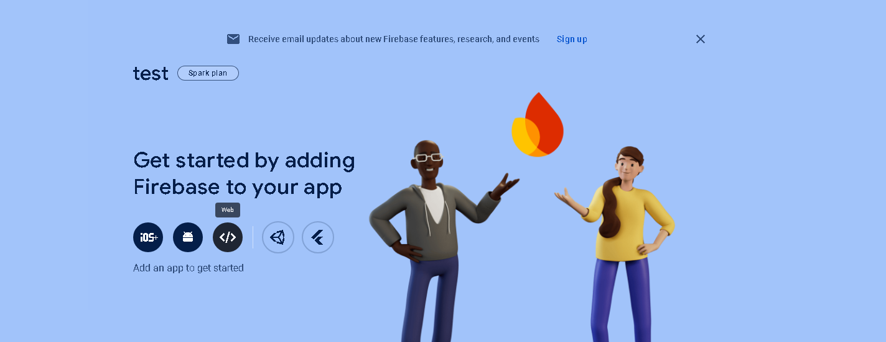

5. Name and register the app

   - 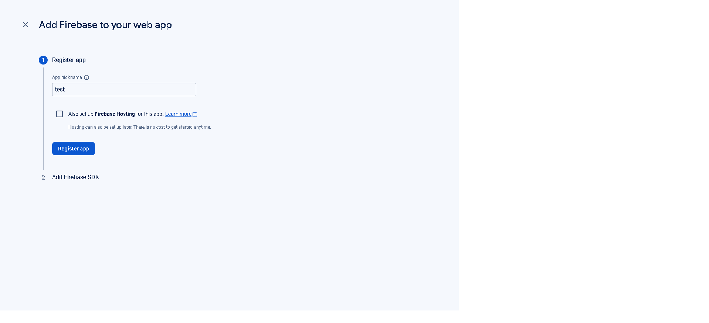

6. Install firebase package by running `npm install firebase` in the directory

7. Create a file for the config and paste the data for the app

   - 

8. Install firebase tools by running `npm install firebase-tools` in the directory

9. Build your app by running `npm run build`.

10. Initialize Firebase by running `firebase init` in the directory.

11. Deploy the app by running `firebase deploy`
