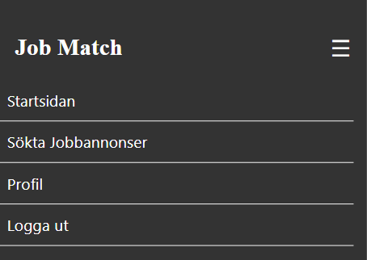
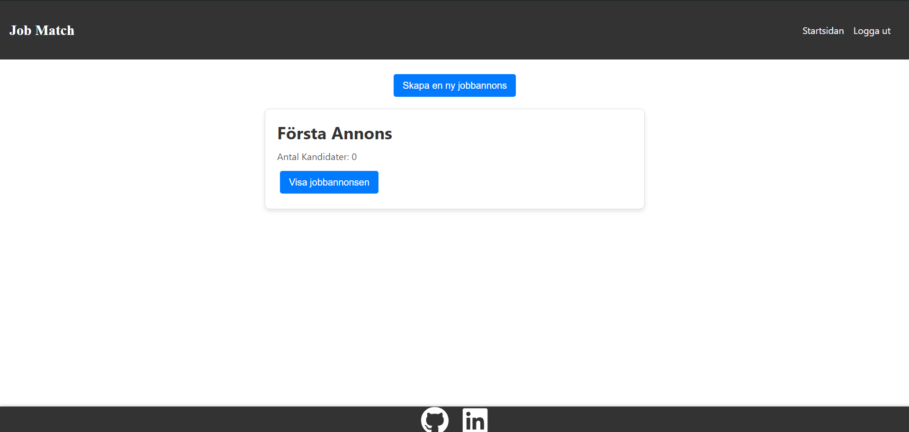
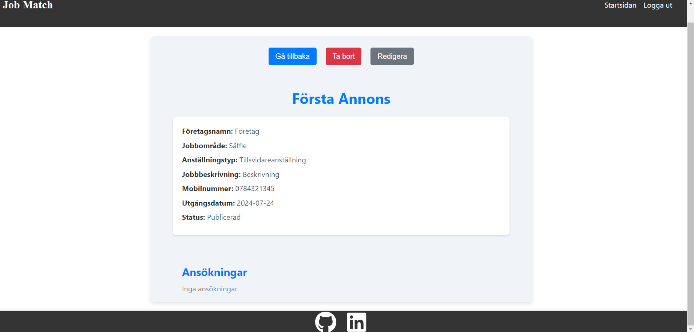
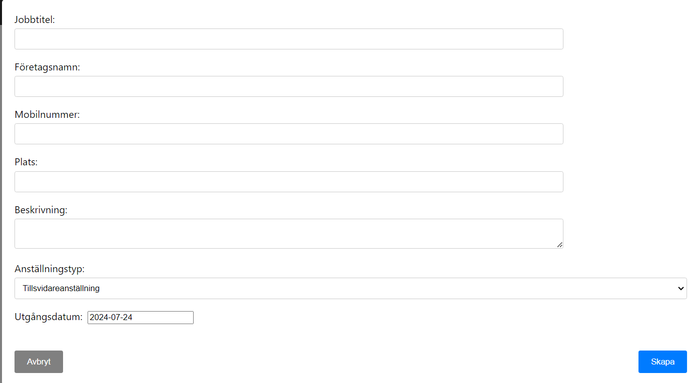
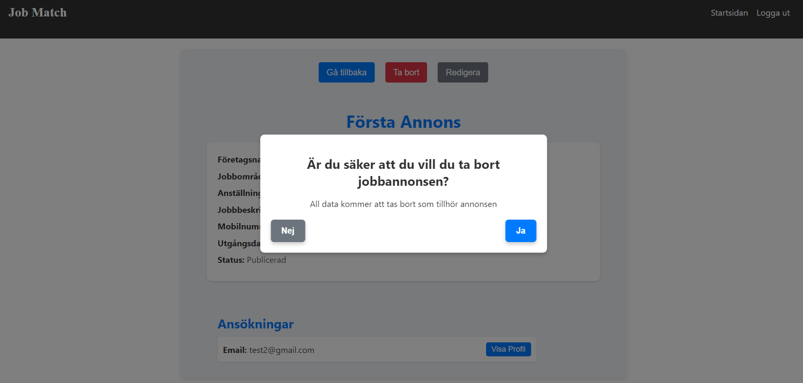
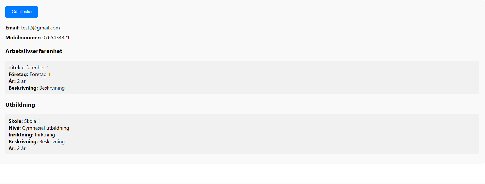
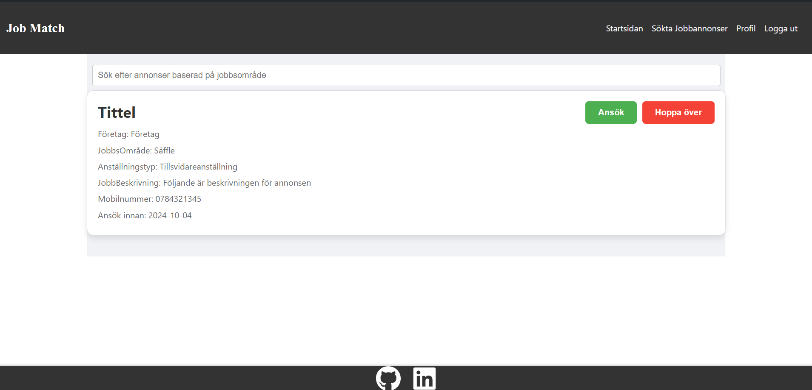
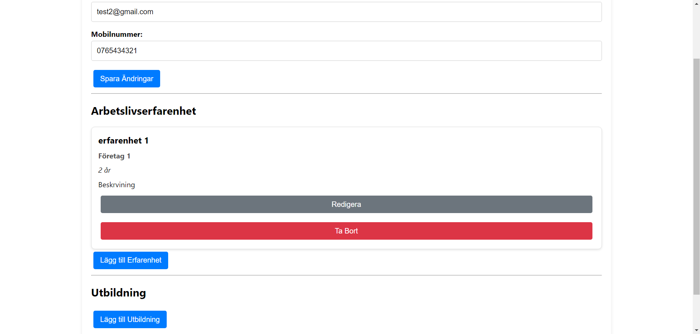
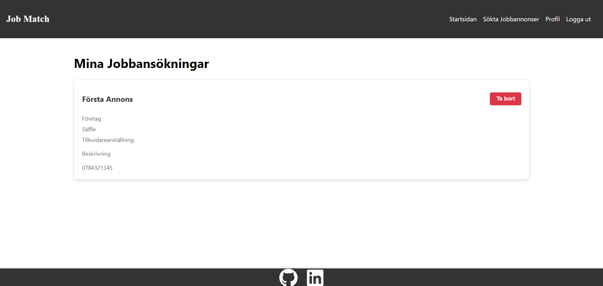

# Features

## Access to pages according to the user role:

| Page Name       | Logged out | Employee | Employer |
| --------------- | ---------- | -------- | -------- |
| Home            | No         | Yes      | Yes      |
| Profile         | No         | Yes      | No       |
| MyJobPosts      | No         | Yes      | No       |
| JobPage         | No         | No       | Yes      |
| ApplicationPage | No         | No       | Yes      |
| Profile         | Yes        | No       | No       |
| MyJobPosts      | Yes        | No       | No       |
| JobPage         | Yes        | No       | No       |
| ApplicationPage | Yes        | No       | No       |

## Main Features:

- Each page has a navbar and a footer

### Navbar:

- ##### Navigation

  - Contains navigation links :
    - HOME - leads to the home page.
    - Log in/out - leads to the login page.
    - Profile (Employee only) - leads to the profile page.
    - Job applications (Employee only) - leads to the applications page.

  - The links have animated hover effect.
  - The navigation is clear and easy to understand for the user.
    

  - The navigation bar is responsive:

    - On mobile devices:

        

      - When the hamburger menu is clicked, there is dropdown menu with the available links.
        

### Home Page (Employer):

The Home Page is for the employer to create/view the jobposts.

The Home Page has:

   -  Button that opens the form for the employer to create a job post.

### Job Page (Employer):

The Page is for the employer to create/view the jobposts.
The Job Page has:
    
  - Go back button that takes the user to the home page.
  - Delete Button that opens the delete modal.
  - Edit button that opens the form with the form filled and ready to edit.

### Create Job Post Modal (Employer):

The Modal is for the employer to create/view the jobposts.

The Modal has

   - Form
   - Cnacel Button
   - Save Button

### Delte Job Post Modal (Employer):

The Modal is for the employer to confirm deletion of a jobpost.

The Modal has

   - Title
   - Subtitle
   - Cnacel Button
   - Save Button

### Application Page (Employer):

The Application Page is for the employer to view a specifc candidate's CV that applied for the job.

---

### Home Page (Employee):

The page is for the employee/Jobseeker to view available jobs and apply for them.

### Prfoile Page (Employee)

The page is for the employee/Jobseeker to view available jobs and apply for them.

The page has:

   - Cards for Job Posts.
   - Skip button.
   - Apply Button.

### Applications Page (Employee)

The page is for the employee/Jobseeker to view which job posts the jobseeker already applied for.

The page has:

   - Cards for Job Posts.
   - Delete button for every Job Post.

---
