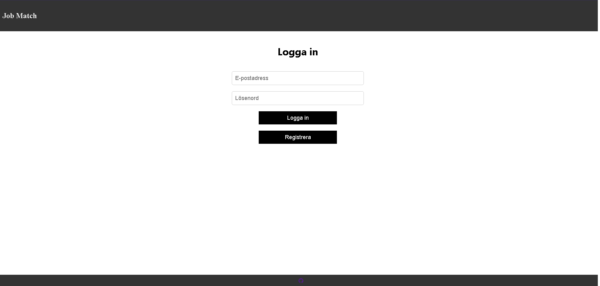
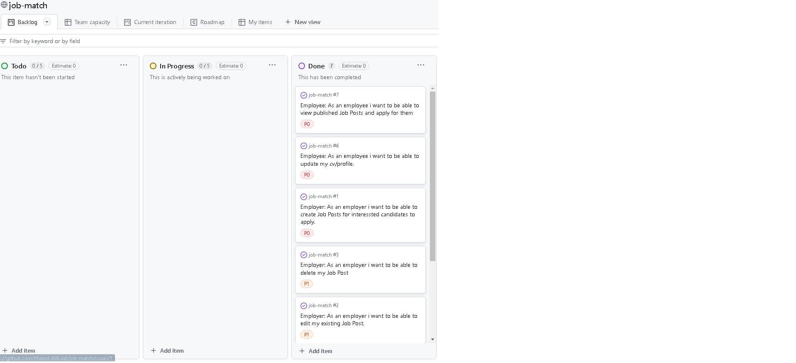
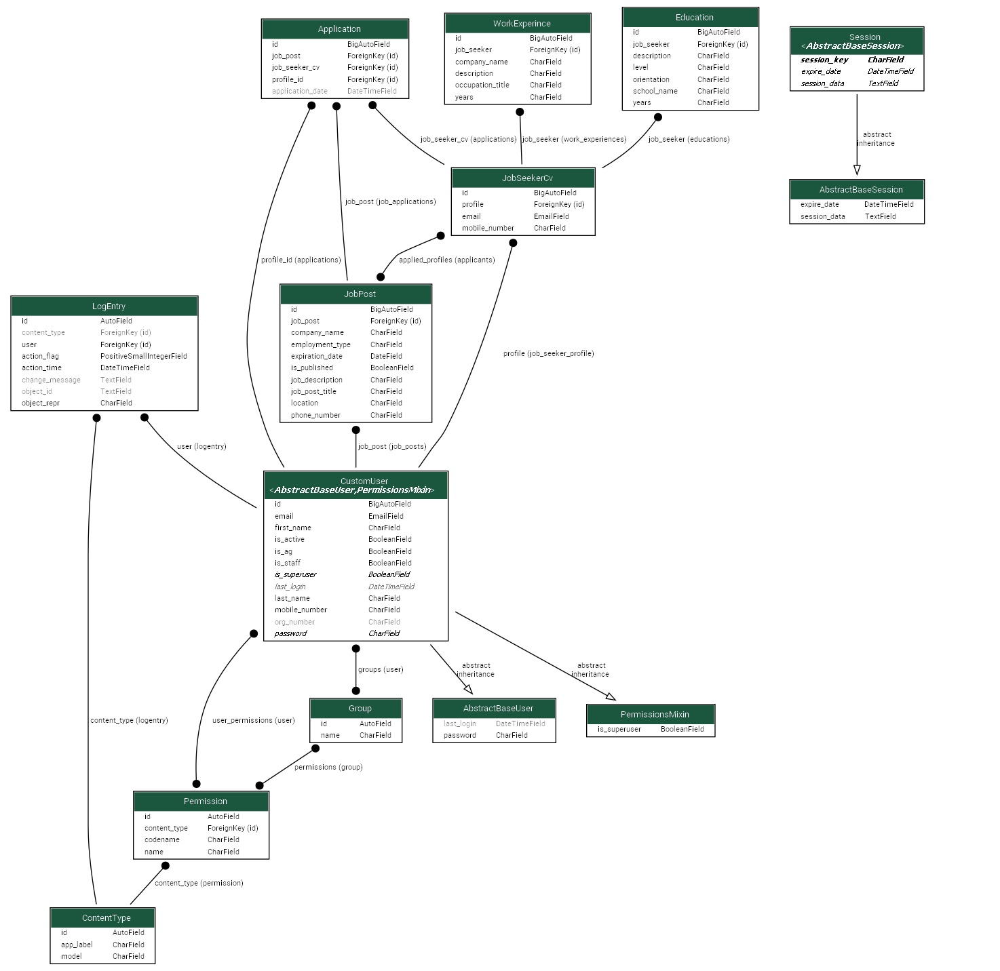

# JobMatch

**Deployed website: [Link to website](https://job-match-web-32db5.web.app/)**

## About

---

## UX

---

### User Stories

#### Employer

| Issue ID                                                                                    | User Story                                                                                 |
| ------------------------------------------------------------------------------------------- | ------------------------------------------------------------------------------------------ |
| [#1](https://github.com/users/Khaled-AlAsadi/projects/1/views/1?pane=issue&itemId=71540103) | As an employer i want to be able to create Job Posts for interessted candidates to apply.  |
| [#2](https://github.com/users/Khaled-AlAsadi/projects/1/views/1?pane=issue&itemId=71540378) | As an employer i want to be able to edit my existing Job Post                              |
| [#3](https://github.com/users/Khaled-AlAsadi/projects/1/views/1?pane=issue&itemId=71540405) | As an employer i want to be able to delete my Job Post                                     |
| [#4](https://github.com/users/Khaled-AlAsadi/projects/1/views/1?pane=issue&itemId=71540432) | As an employer i want to be able to view the candidates profiles that applied for the job. |
|                                                                                             |

#### Employee

| Issue ID                                                                                    | User Story                                                                      |
| ------------------------------------------------------------------------------------------- | ------------------------------------------------------------------------------- |
| [#1](https://github.com/users/Khaled-AlAsadi/projects/1/views/1?pane=issue&itemId=71540462) | As an employee i want to be able to create my cv/profile to apply with.         |
| [#2](https://github.com/users/Khaled-AlAsadi/projects/1/views/1?pane=issue&itemId=71540489) | As an employee i want to be able to update my cv/profile.                       |
| [#3](https://github.com/users/Khaled-AlAsadi/projects/1/views/1?pane=issue&itemId=71540519) | As an employee i want to be able to view published Job Posts and apply for them |
|                                                                                             |
|                                                                                             |

---

## Future Development

---

## Technologies used

- ### Languages:

  - [Python 3.8.5](https://www.python.org/downloads/release/python-385/): the primary language used to develop the server-side of the website.
  - [JS](https://www.javascript.com/): the primary language used to develop interactive components of the website.
  - [HTML](https://developer.mozilla.org/en-US/docs/Web/HTML): the markup language used to create the website.
  - [CSS](https://developer.mozilla.org/en-US/docs/Web/css): the styling language used to style the website.

- ### Frameworks and libraries:

  - [Django](https://www.djangoproject.com/): python framework used to create all the logic.
  - [React](https://react.dev/): react framework was used to create all the frontend components.

- ### Databases:

  - [SQLite](https://www.sqlite.org/): was used as a development database.
  - [PostgreSQL](https://www.postgresql.org/): the database used to store all the data.

- ### Other tools:

---

## Features

Please refer to the [FEATURES.md](FEATURES.md) file for all test-related documentation.

---

## Design

### Typography

### Imagery

### Wireframes

[Wireframes](documentaion/design/wireframes.pdf)

---

## Agile Methodology

### GitHub Project Management

---

## Flowcharts

To understand app flow, I created flowchart.

[Flowchart](documentaion/flowcharts/flow_chart.png)

---

## Information Architecture

### Database

- During the earliest stages of the project, the database was created using SQLite.
- The database was then migrated to PostgreSQL.

### Entity-Relationship Diagram

### Data Modeling

---

## Testing

Please refer to the [TESTING.md](TESTING.md) file for all test-related documentation.

---

## Deployment and Payment setup

- The api was deployed to [Render](https://render.com/).

- The app was deployed to [Firebase](https://firebase.google.com/)

- The database was deployed to [ElephantSQL](https://www.elephantsql.com/).

- The app can be reached by the [link](https://wowder.onrender.com).

Please refer to the [DEPLOYMENT.md](DEPLOYMENT.md) file for all deployment and payment-related documentation.

---

## Credits

- [GitHub](https://github.com/) for giving the idea of the project's design.
- [Django](https://www.djangoproject.com/) for the framework.
- [Font awesome](https://fontawesome.com/): for the free access to icons.
- [Render](https://render.com/): for providing a free hosting.
- [Firebase](https://firebase.google.com/): for providing a free hosting.
- [Postgresql](https://www.postgresql.org/): for providing a free database.
- [Graphviz](https://graphviz.org/download/): for generating Picture of database model.
